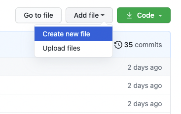
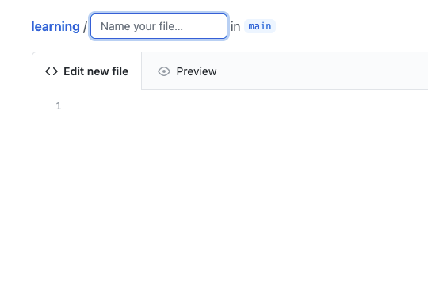

# Learning

プログラミングなどを学習する際のお手伝いになりそうなドキュメントまとめ。

ここに書いていないものは適宜ネットから見つけてやってください。仕様などで困ったときは公式ドキュメントを読むと幸せになれるかも。

マークダウンで記述されているので、誤字脱字、内容にミス等あれば修正依頼のPull Requestをお願いします。また、何か書き残したい場合は是非どうぞ。クローンしなくてもある程度はGitHub.com上で編集可能です。（書き込み権限がなければ連絡をお願いします。）

## カテゴリー一覧

- [JavaScript](./javascript/README.md)
- [Node.js](./nodejs/README.md)
- [Git](./git/README.md)
- [Discord](./discord/README.md)

## GitHub.com上でのファイル追加

1. `Add file`→`Create new file`を選択

2. コードを書ける画面が表示されるので、`Name your file...`にファイル名を入力して内容を書き込んだら、一番下にある`Commit changes`でコミットする

＊ファイル名を入力する際、スラッシュ`/`で区切ると下の階層のディレクトリに移動できる

